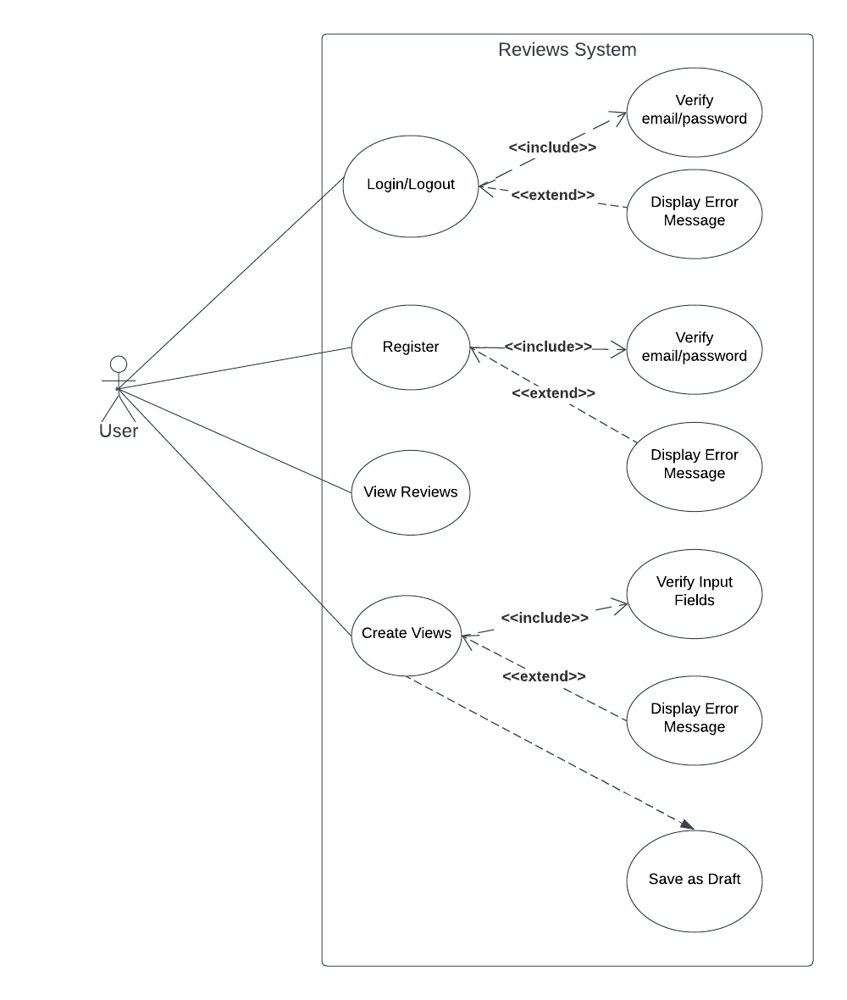

# Reviews-System

## Main Feature

- Login Module

  - Sign In
  - Sign Out
  - Register

- List Reviews

  - Create Review
  - Save as Draft Review
  - View All Reviews

## Technologies

- State Management: React Context
- Router: React Router
- Library UI : Ant desgin , React Toastify

## Folder Structure

```shell
|--src # Main Logic Code
|   |--- components # Share UI
|   |--- constants # constants variable
|   |--- contexts # Management global state
|   |--- mockup
|   |--- pages # Setup UI for each page
|   |--- models # Setup Interface for System
|   |--- utils # Setup Axios,...
|   |--- app.tsx
|   |--- main.tsx
|   |--- useRouteElement.tsx # Setup Router
|   |--- index.scss # Setup global scss
|
|-- tsconfig.json # Config TS
|
```

## Set up virtual environment

```
npm install
```

## Run app

```
npm run dev
```

Runs the app in the development mode.
Open http://localhost:5173 to view it in your browser.

## Run build

```
npm run build
```

Builds the app for production to the dist folder.
It correctly bundles React in production mode and optimizes the build for the best performance.
The build is minified and the filenames include the hashes.
Your app is ready to be deployed!

## UseCase Diagram


